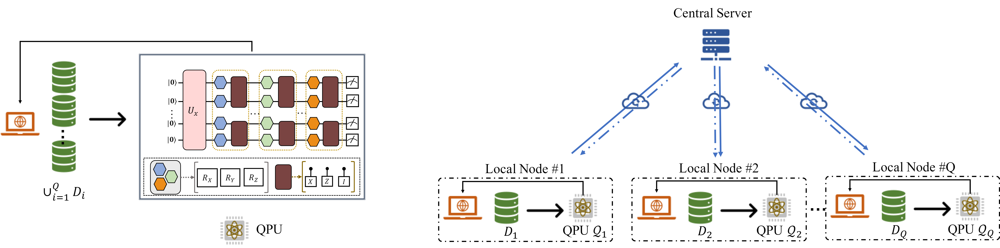

# Accelerating variational quantum algorithms with multiple quantum processors

This repository is the official implementation of [*Accelerating variational quantum algorithms with multiple quantum processors*](https://arxiv.org/abs/2106.12819).

>Variational quantum algorithms (VQAs) have the potential of utilizing near-term quantum machines to gain certain computational advantages over classical methods. Nevertheless, modern VQAs suffer from cumbersome computational overhead, hampered by the tradition of employing a solitary quantum processor to handle large-volume data. As such, to better exert the superiority of VQAs, it is of great significance to improve their runtime efficiency. Here we devise an efficient distributed optimization scheme, called QUDIO, to address this issue. Specifically, in QUDIO, a classical central server  partitions the learning problem into multiple subproblems and allocate them to multiple local nodes where each of them consists of a quantum processor and a classical optimizer.  During the training procedure, all local nodes proceed parallel optimization and the classical server synchronizes  optimization information among local nodes timely. In doing so, we prove a sublinear convergence rate of QUDIO in terms of the number of global iteration under the ideal scenario, while the system imperfection may incur divergent optimization. Numerical results on standard benchmarks demonstrate that QUDIO can surprisingly achieve a superlinear runtime speedup with respect to the number of local nodes. Our proposal can be readily mixed with other advanced VQAs-based techniques  to narrow the gap between the  state of the art and applications with quantum advantage.



## Requirements:

```setup
pip install -r requirements.txt
```

## Usage

### Run QUDIO for MNIST

```bash
python train_torch.py --K 8 --W 8 --port 1001 --p 1 --M 100 --seed 0
```

### Run QUDIO for VQE
```bash
python train_torch_vqe.py --K 8 --W 8 --port 1001 --p 1 --M 100 --seed 0 --mol LiH
```

## Dependencies

- Python >= 3.8
- PyTorch >= 1.8.0